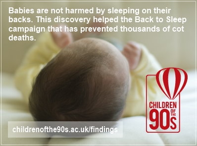
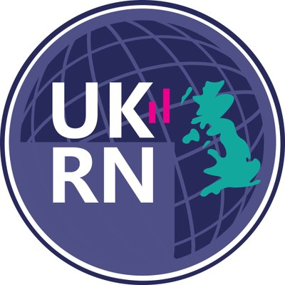
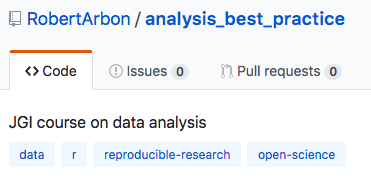

## Jean Golding Institute

* Jean Golding Institute for data intensive research
* We support interdisciplinary research across the university:
  * Build new multidisciplinary communities
  * Catalyse new ideas
  * Procure seed corn funding
  * Deliver impact and engagement
  * Promote and raise the profile of the University
  * Enrich the undergraduate and postgraduate student experience

---

## Jean Golding

* Professor Jean Golding OBE is an epidemiologist at Bristol
* She set up the ALSPAC (Child of the 90s) study
* One of 25 women selected as part of the [*put her forward*](http://putherforward.com) campaign. 
  * The statue will be moved to Royal Fort House soon. 

--- &twocol

## ALSPAC achievements 

   
*** =left
    

    
*** =right

--- &twocol

## Who we are

*** =left

### Natalie Thurlby 

*** =right
### Robert Arbon

--- 

## UK Reproducibility Network

--- &twocol

## About this course

*** =left
- First course of its type at Bristol (AFAWK)
- **Aim**: introduce you to ideas and tools which you will take further in your own time
- **Delivery**:
  - Lectures
  - Discussion
  - Practicals
- **Outcomes**:
  - Introduced to the ideas and tools of reproducible research
  - Reproduce results of a paper 
*** =right  
- Please give constructive feedback on:

[github.com/RobertArbon/analysis_best_practice](https://github.com/RobertArbon/analysis_best_practice)

---

## Itinerary

1. 09:15 - 09:30 Introduction (RA)
1. 09:30 - 10:30 Reproducible research (NT)
1. 10:30 - 11:00 Coffee break
1. 11:00 - 12:30 Your research ecosystem (NT)
  * IDEs, Version control, literate programming, Open Science Framework
1. 12:30 - 13:30 Lunch
1. 13:30 - 15:00 Managing and processing data (RA)
  * FAIR principles, storing and retrieving data, tidy data, metadata, file formats. 
1. 15:00 - 15:30 Coffee
1. 15:30 - 17:00 Mini reproducibility project (RA & NT)
